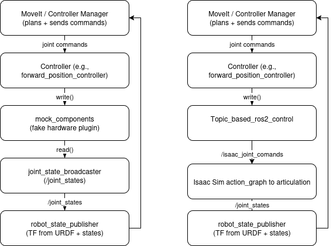

# UR10e + Robotiq 2F140 Stack with Isaac Sim - Setup Guide

This guide provides step-by-step instructions for setting up and running a **UR10e robotic arm** with **Robotiq 2F140 gripper** stack, integrated with **Isaac Sim** for advanced robotics simulation and development.

## What You'll Get

- **UR10e Robotic Arm**: A 6-DOF collaborative robot arm with 10kg payload capacity
- **Robotiq 2F140 Gripper**: A versatile 2-finger adaptive gripper with 140mm stroke
- **Dual Development Environment**: Two separate devcontainers for different development approaches
  - **ROS 2 DevContainer**: Full ROS 2 development environment for robot control and planning
  - **Isaac Sim DevContainer**: GPU-accelerated simulation with ROS 2 bridge integration
- **Two Control Strategies**:
  - **Mock Components**: Fast development with simulated robot behavior
  - **Topic-based ROS 2 Control**: Real-time integration between ROS 2 and Isaac Sim

## Key Benefits

- **Parallel Development**: Run ROS 2 and Isaac Sim simultaneously in separate containers
- **Flexible Control**: Choose between mock simulation or real-time Isaac Sim integration
- **GPU Acceleration**: NVIDIA runtime support for high-performance Isaac Sim simulation

## Sources 
- **Forked main Repository**: https://git.cps.unileoben.ac.at/Niko/UR_Robotiq - A super clean ROS2 integration of UR + gripper in the recommended way with useful features like keyboard/gamepad control, cartesian control etc...
- **UR Official Repositories**: 
  - [Universal_Robots_ROS2_Description](https://github.com/UniversalRobots/Universal_Robots_ROS2_Description)
  - [Universal_Robots_ROS2_Driver](https://github.com/UniversalRobots/Universal_Robots_ROS2_Driver)
- **Robotiq Gripper Repositories**:
  - [ros2_robotiq_gripper](https://github.com/robotiq/ros2_robotiq_gripper)
- **ROS 2 Control Tutorials**:
  - [Topic-based Control Tutorial](https://github.com/PickNikRobotics/topic_based_ros2_control)

## Assumptions & Simplifications
- I've modified some of the core urdf/xacro from UR & Robotiq in not the really good way. I've done it to make it work fast, and so I broke some "dynamic" workflow. If you're familiar with the ur_description, you will see that if you try to change the UR model, it will not work. This is the famous technical debt.

## Prerequisites

- **Ubuntu 22.04/24.04** (or compatible Linux distribution)
- **Docker** and **Docker Compose** installed
- **NVIDIA GPU** with proper drivers (for Isaac Sim)
- **VS Code** with the **Dev Containers** extension
- **Git** for cloning the repository
- **At least 16GB RAM** (recommended for Isaac Sim)
- **At least 50GB free disk space**

---

# 🚀 PART 1: PREPARATION STEPS

## Step 0: Verify Prerequisites

Before proceeding, ensure all prerequisites are met:

```bash
# Check Docker installation
docker --version
docker-compose --version

# Check NVIDIA drivers and Docker GPU access
nvidia-smi
docker run --rm --gpus all nvidia/cuda:11.0-base nvidia-smi


# Verify VS Code Dev Containers extension is installed
# (Check Extensions panel in VS Code)
```

## Step 1: Clone and Setup the Repository
(If you want to get the .zip or .tar instead, don't forget to remove the "-main" on downloaded folder)

```bash
# Clone the repository
git clone https://gitlab.com/quentin.deyna/ur10e_2f140_topic_based_ros2_control
cd ur10e_2f140_topic_based_ros2_control

# Verify the workspace structure
ls -la

# Run it every time you restart, Allow X11 forwarding for GUI applications
xhost +
```

## Step 2: Understanding the Dual DevContainer Setup

This project uses **two separate devcontainers** that can run **simultaneously** for different development approaches:

### **A. Isaac Sim DevContainer** (`.devcontainer/isaac/`)
- **Purpose**: Isaac Sim simulation with ROS 2 bridge integration
- **Use case**: When you want to run Isaac Sim and control the robot through ROS 2 topics
- **Features**: 
  - NVIDIA runtime support for GPU acceleration
  - Pre-configured Isaac Sim environment
  - ROS 2 bridge for topic communication
  - Workspace at `/ros2_ws`
  - Isaac Sim 4.5.0

### **B. ROS 2 DevContainer** (`.devcontainer/ros2/`)
- **Purpose**: Full ROS 2 development and robot control environment
- **Use case**: When you want to build, test, and control the robot like real hardware
- **Features**:
  - Complete ROS 2 development environment
  - All ROS 2 packages and dependencies
  - MoveIt, controllers, and servo capabilities
  - Workspace at `/ros2_ws`
  - ROS 2 Humble with all dependencies
- **Best for**: Robot programming, MoveIt planning, and controller development

**Why run both simultaneously?** You can develop your ROS 2 nodes in one container while running Isaac Sim in the other, creating a powerful development workflow where you can see your code's effects in real-time simulation.

## Step 3: Launch DevContainer

**Note:** Both containers can run in parallel

### **For Isaac Sim (Goal: Simulation)**
1. **Open VS Code** in the project directory
2. **Press `Ctrl+Shift+P`** and select **"Dev Containers: Reopen in Container"**
3. **Choose "Isaac DevContainer"** configuration
4. **Wait for container build** (this may take several minutes on first run)

### **For ROS 2 Development (Goal: Real Robot Feel)**
1. **Open VS Code** in the project directory
2. **Press `Ctrl+Shift+P`** and select **"Dev Containers: Reopen in Container"**
3. **Choose "UR5 ROS2 DevContainer"** configuration
4. **Wait for container build** (this may take several minutes on first run)

**Why containers?** Containers provide isolated, reproducible environments that ensure consistent behavior across different systems and avoid dependency conflicts. They also make it easier to share the exact development environment with others.

**Why two containers?** The ROS 2 container gives you the full robot control experience (like controlling real hardware), while the Isaac container focuses on simulation integration. This separation allows you to optimize each environment for its specific purpose without compromising performance or functionality.

## Step 4: Build the ROS 2 Workspace

When you start the ROS2 container, there are two scripts that run automatically:
- One for `rosdep install` (dependency installation)
- Another for `ros2 colcon build` (with symlink)

So once you're inside the container, just run:

```bash
# Source the workspace
source install/setup.bash
```

**Note:** If the automatic build fails or you need to rebuild, you can manually run:
```bash
# Install dependencies
rosdep install --from-paths src --ignore-src -r -y

# Build the workspace
colcon build --symlink-install
```

---

# 🎯 PART 2: RUNNING DIFFERENT OPTIONS

## Step 5: Launch the Robot Stack 

This setup offers **two distinct control strategies** for different development needs:

### **Option A: Mock Components Control (Fast Development)**

**What it does**: The ROS 2 application works with MoveIt in simulation mode. Commands are processed internally, simulating robot behavior without external dependencies.

**Key characteristics**:
- ✅ **Fast execution** - No external simulation delays
- ✅ **Predictable behavior** - Joint states follow MoveIt's kinematic solutions exactly
- ✅ **Isaac Sim integration** - Can run Isaac in parallel for visualization
- ⚠️ **Limited physics** - Isaac Sim collisions don't affect MoveIt planning
- ⚠️ **No real-world simulation** - Robot behavior is idealized

**Best for**: Quick development, testing algorithms, and learning MoveIt without simulation complexity.



**Ros2 container Terminal 1:** Run the ros2_control side:

```bash
ros2 launch ur_robotiq_description ur_robotiq_control.launch.py robot_ip:=aaa.bbb.ccc.ddd use_fake_hardware:=true launch_rviz:=false initial_joint_controller:=joint_trajectory_controller
```

**Ros2 container Terminal 2:** Launch MoveIt:

```bash
ros2 launch ur_robotiq_moveit_config ur_robotiq_moveit.launch.py use_fake_hardware:=true
```

**Isaac container Terminal 1:** Start Isaac Sim:

```bash
./script/post_install_ros2_isaac_start.sh
```

**Open** the prepared USD files at:

```
assets/ur10e_robotiq2f-140/ur10e_robotiq2f-140-mock_components.usd
```

**Run simulation** and verify the robot model loads correctly

### **Option B: Topic-based ROS 2 Control (Real-time Integration)**

**What it does**: Integrates Isaac Sim directly into the ROS 2 control loop. MoveIt sends commands to ros2_control, which then communicates with Isaac Sim for real-time physics simulation.

**Key characteristics**:
- ✅ **Real physics simulation** - Isaac Sim handles collisions, gravity, and physics
- ✅ **Integrated control loop** - ROS 2 and Isaac Sim work together
- ✅ **Real-world behavior** - Robot responds to physical constraints and obstacles
- ✅ **Error handling** - ROS 2 stack raises errors if Isaac Sim encounters issues
- ⚠️ **Slower execution** - Physics simulation adds computational overhead
- ⚠️ **More complex setup** - Requires proper synchronization between systems

**Best for**: Production simulation, physics-based testing, and real-world scenario validation. 

**Ros2 container Terminal 1:** Run the ros2_control side:

```bash
# Launch Isaac Sim control
ros2 launch ur_robotiq_description ur_robotiq_isaac_control.launch.py robot_ip:=aaa.bbb.ccc.ddd sim_isaac:=true
```

**Ros2 container Terminal 2:** Launch MoveIt:

```bash
ros2 launch ur_robotiq_moveit_config ur_robotiq_isaac_moveit.launch.py use_fake_hardware:=true
```

**Isaac container Terminal 1:** Start Isaac Sim:

```bash
./script/post_install_ros2_isaac_start.sh
```

**Open** the prepared USD files at:

```
assets/ur10e_robotiq2f-140/ur10e_robotiq2f-140-topic_based.usd
```

**Run simulation** and verify the robot model loads correctly

**Note:** If Isaac Sim fails to start, check:
- NVIDIA drivers are properly installed on the host
- Docker has access to GPU: `docker run --rm --gpus all nvidia/cuda:11.0-base nvidia-smi`
- Container has proper GPU access permissions

---

# 📋 PART 3: VERIFICATION & TROUBLESHOOTING

## Verification Steps

### **1. System Health Check**

```bash
# Check all nodes are running
ros2 node list

# Verify topics are active
ros2 topic list

# Check controller status
ros2 control list_controllers

# Monitor system resources
htop
nvidia-smi  # For GPU usage (Isaac container)
```

### **2. Basic Functionality Test**

```bash
# Check if topics are active
ros2 topic info /joint_states --verbose
ros2 topic info /robotiq_gripper_joint_states --verbose

# Test joint state publishing
ros2 topic echo /joint_states

# Test gripper joint states
ros2 topic echo /robotiq_gripper_joint_states

# Test controller status
ros2 control list_controllers
```

## Troubleshooting

### **Common Issues and Solutions**

1. **Robot not responding**
   - Verify controllers are active: `ros2 control list_controllers`
   - Check for error messages in the launch terminal
   - Ensure hardware interface is properly configured

2. **Isaac Sim not receiving commands**
   - Ensure Action Graph subscribers are correctly configured
   - Check topic types match (`sensor_msgs/JointState`)
   - Verify ROS 2 bridge is active in Isaac Sim
   - Check USD file path and robot model loading
   - Ensure Isaac Sim is running before launching ROS 2 nodes

3. **Build errors**
   - Ensure all dependencies are installed: `rosdep install --from-paths src --ignore-src -r -y`
   - Check package.xml for correct dependencies
   - Verify ROS 2 version compatibility
   - Clear build cache: `rm -rf build/ install/ log/`
   - Rebuild

4. **Topic not found**
   - Use `ros2 topic list` to see available topics
   - Check if nodes are running: `ros2 node list`
   - Verify launch files are using correct node names
   - Check if topics are being published: `ros2 topic hz /topic_name`

5. **MoveIt planning failures**
   - Check joint limits configuration
   - Verify collision objects are properly defined
   - Ensure planning scene is properly initialized
   - Check planning library configuration in moveit config

6. **Container startup issues**
   - Verify Docker is running: `sudo systemctl status docker`
   - Check available disk space: `df -h`
   - Ensure Docker has GPU access: `docker run --rm --gpus all nvidia/cuda:11.0-base nvidia-smi`
   - Check container logs: `docker logs <container_name>`


---

# 🎯 SUMMARY

This setup provides a comprehensive development environment for the **UR10e + Robotiq 2F140** robotic system:

### **Dual DevContainer Architecture:**
- **ROS 2 DevContainer**: Full robot control experience with MoveIt, planning, and real-time servoing
- **Isaac Sim DevContainer**: GPU-accelerated physics simulation with ROS 2 bridge integration
- **Parallel Operation**: Run both containers simultaneously for integrated development workflow

### **Two Control Strategies:**
- **Mock Components**: Fast development with predictable, idealized robot behavior
- **Topic-based Control**: Real-time physics simulation with Isaac Sim integration

### **Key Benefits:**
- **Flexible Development**: Choose the right approach for your current development phase
- **Safety Features**: Collision checking, joint limits, and error handling
- **Modular Architecture**: Easy to extend and customize for specific applications

### **Development Workflow:**
1. **Start with Mock Components** for fast algorithm development and testing
2. **Switch to Topic-based Control** when you need physics simulation and real-world validation
3. **Run both containers** for integrated development with real-time simulation feedback

The system gives you the flexibility to develop in a full ROS 2 environment (like real hardware) while maintaining the option to integrate with Isaac Sim for advanced simulation capabilities.

License
This project is licensed under the BSD 3-Clause License 
Portions of the code are adapted from:

    Universal Robots ROS 2 repositories (BSD-3-Clause)

    Robotiq ROS 2 repositories (BSD-3-Clause / Apache-2.0)

    ROS 2 Control Tutorial by PickNik Robotics (Apache-2.0)
